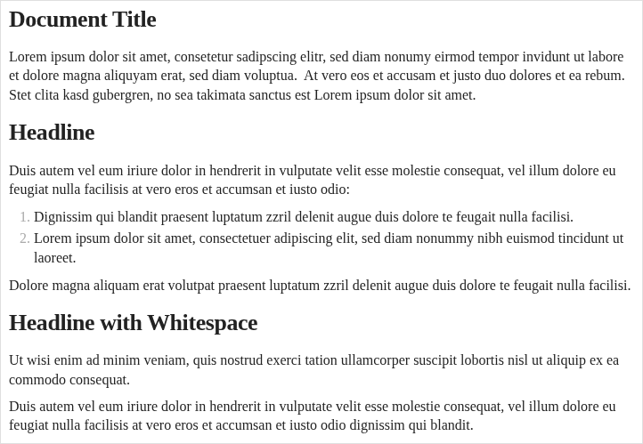
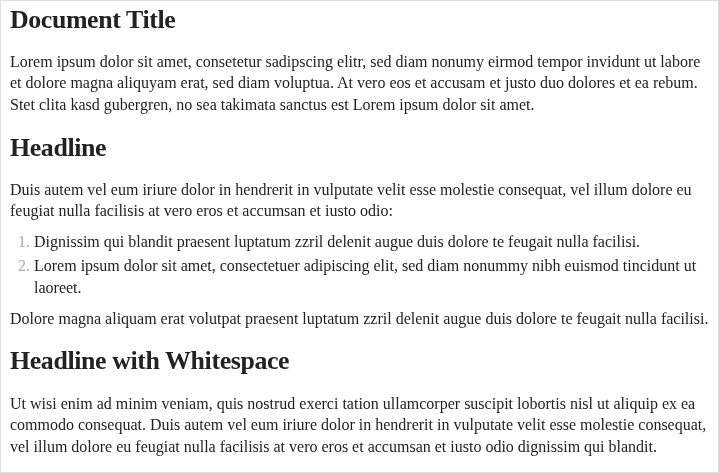
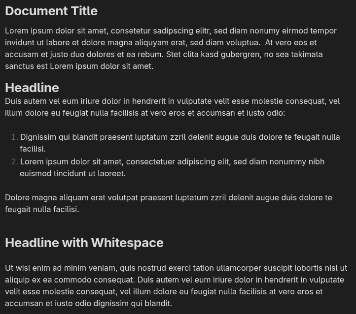
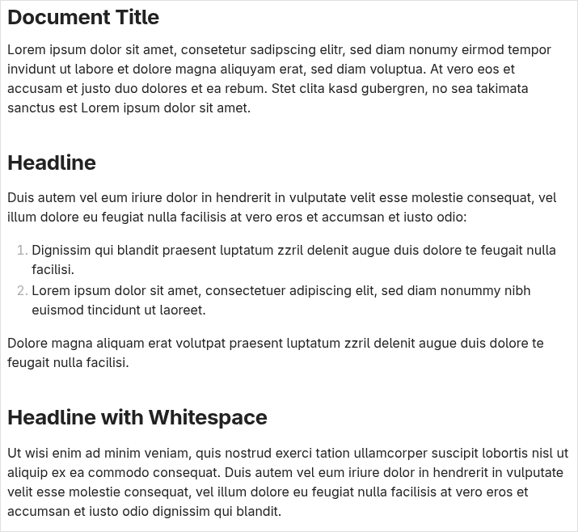
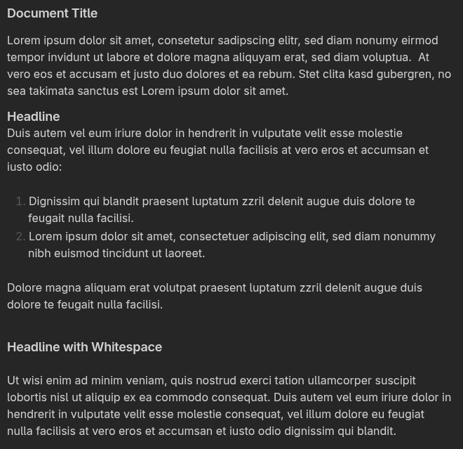
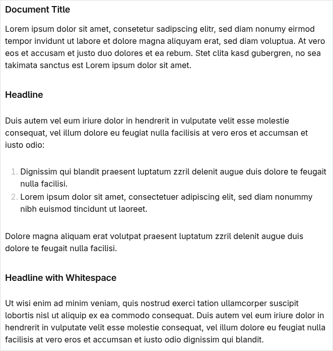

Summary
=======

*Obsidian-Typo* is a collection of CSS snippets for *Obsidian*, refining
the typography of rendered text in the editor.  It focuses mainly on the
way how whitespace is displayed by *Obsidian*, without affecting the
markdown code of the documents.  It is predictable, free of heuristics, and
reversible by deactivation of the snippets.

*Obsidian* is a Markdown (``.md`` files) editor.  It uses an HTML-based
interface employing *Electron*.  Due to the nature of an HTML-based GUI,
*all* interface components of *Obsidian* can be styled by CSS (*Cascading
Style Sheets*).  Style sheets can be given either as *themes* or as *CSS
snippets*.  While writing texts with Obsidian, I found the rendering of
*whitespace* often inadequate, especially whitespace around headlines, but
also in places like in the surroundings of enumerations and itemisations.
Presented here is *Obsidian-Typo*, a set of CSS snippets implementing
primarily typographic rules related to whitespace, but also addressing a
few topics more.  *Obsidian* distinguishes between *reading mode* and
*editing mode*.  *Obsidian-Typo* brings these two very close to each other,
implementing all major achievements already in editing mode.
*Obsidian-Typo* is *not* a theme.  It is of no influence whatsoever on the
general UI appearance, and addresses *only* the typography in *reading
mode* and in *editing mode*.  *Obsidian-Typo* is designed in such a way,
that the application of its CSS codes to a given *Obsidian Vault* does not
require adaption of the markdown sources for the vault's documents.  It
further compensates many adjustments made before using additional blank
lines *from the beginning* wherever possible and appropriate.  Because with
*Obsidian-Typo* the typography is optimised already in editing mode, the
usage of *Obsidian* benefits from *Obsidian-Typo* early on, improving user
experience with Obsidian from the beginning of drafting Obsidian documents.

The remainder sections of this README are structured in the following way:

1.  In the next section, a *Demonstration* of rendering some sample MD code
    is given by providing the results of:

    a)  using *Obsidian-Typo* (with the Default theme);
    b)  working without *Obsidian-Typo*, using either the vanilla Default theme
        or kepano's *Minimal* theme.

2.  Below the *Demonstration* section, a short instruction for how to
    install *Obsidian-Typo* to an Obsidian Vault is given.

3.  For further reference, the *Documentation* might be a good starting
    point, which it is mentioned in the end of this README file.

Demonstration
=============

Sample Markdown Code
--------------------

The following Markdown code is to be displayed by Obsidian:

.. code:: markdown

    Lorem ipsum dolor sit amet, consetetur sadipscing elitr, sed diam
    nonumy eirmod tempor invidunt ut labore et dolore magna aliquyam erat,
    sed diam voluptua.  At vero eos et accusam et justo duo dolores et ea
    rebum. Stet clita kasd gubergren, no sea takimata sanctus est Lorem
    ipsum dolor sit amet.
    # Headline
    Duis autem vel eum iriure dolor in hendrerit in vulputate velit esse
    molestie consequat, vel illum dolore eu feugiat nulla facilisis at vero
    eros et accumsan et iusto odio:

    1. Dignissim qui blandit praesent luptatum zzril delenit augue duis
       dolore te feugait nulla facilisi.
    2. Lorem ipsum dolor sit amet, consectetuer adipiscing elit, sed diam
       nonummy nibh euismod tincidunt ut laoreet.

    Dolore magna aliquam erat volutpat praesent luptatum zzril delenit
    augue duis dolore te feugait nulla facilisi.

    # Headline with Whitespace

    Ut wisi enim ad minim veniam, quis nostrud exerci tation ullamcorper
    suscipit lobortis nisl ut aliquip ex ea commodo consequat.

    Duis autem vel eum iriure dolor in hendrerit in vulputate velit esse
    molestie consequat, vel illum dolore eu feugiat nulla facilisis at vero
    eros et accumsan et iusto odio dignissim qui blandit.

In this listing, additional linebreaks have been added to keep the MD code
readable without horizontal overflow.  In the file which is actually *used*
for this demonstration, each paragraph is provided on *one single line*.

There are two headlines presented here:  The first one (*"Headline"*) is
written directly adjacent to the continuous text around it, while the
second one (*"Headline with Whitespace"*) is padded by one single blank
line above and below.

Rendering using *Obsidian-Typo*
-------------------------------

In this demonstration, *Obsidian-Typo* is used with the Default theme.

With *Obsidian-Typo* enabled, the results in live mode are:

and in preview mode:

The styles introduced by *Obsidian-Typo* provide unified whitespace around
the two headlines, result in an appropriate separation around the
enumeration (in the section below the *Headline*) and to an adequate
spacing between the two paragraphs in the second section (below *Headline
with Whitespace*).

The blank lines surrounding the *Headline with Whitespace* are of no effect
to the typeset result, while they remain unaltered in the MD sources.

These findings apply both to the editing mode display as well as to the
reading mode.

Rendering with the Default Theme
--------------------------------

Rendering in live mode with the vanilla Default theme looks like:

while in preview mode the result is:

Rendering with kepano's Minimal Theme
-------------------------------------

With the pure Minimal theme, the given MD code is shown in live mode as:

and the preview is:

Installation
============

*Obsidian-Typo* is provided as a set of CSS snippets which can be installed
to a given Obsidian Vault.  These CSS snippets are located in the ``CSS``
folder, which is located directly besides of this README in the root
directory of the *Obsidian-Typo* repository.  The installation of
*Obsidian-Typo* consists in the following procedure:

1.  Each Obsidian vault carries a dot-directory ``.obsidian`` in its root
    directory.  CSS snippets like those provided by *Obsidian-Typo* are
    made available by copying them to a subfolder ``snippets`` of the
    ``.obsidian`` folder.  They are always installed *per vault*.  When the
    vault in question exists in ``/path/to/vault/``, the corresponding
    directory is ``/path/to/vault/.obsidian/snippets/``.  The ``snippets``
    folder does not exist in newly created Obsidian vaults in the
    beginning, it needs to be created once.

2.  After having installed the CSS snippets, they need to be *enabled* in
    the *Appearance* pane of the vault's settings in Obsidian.  The
    switches used for this purpose are located in the bottom end of the
    *Appearance* pane.

Nothing beyond these two steps is required to install *Obsidian-Typo*.  To
revert back to the state without *Obsidian-Typo*, the snippets can be
either *deactivated* in the *Appearance* pane, or they can be just
*removed* from the ``snippets`` folder.

Further hints on the installation process are provided in the documentation
referred to below at the end of this README.

Documentation
=============

Documentation is maintained in a separate repository and is distributed as
a ZIP archive (``Typo-Doc.zip``) located in the root directory of this
repository.

The documentation is licensed independently from the MIT-licensed CSS code.
