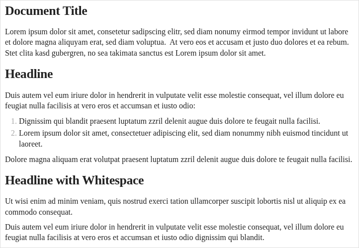
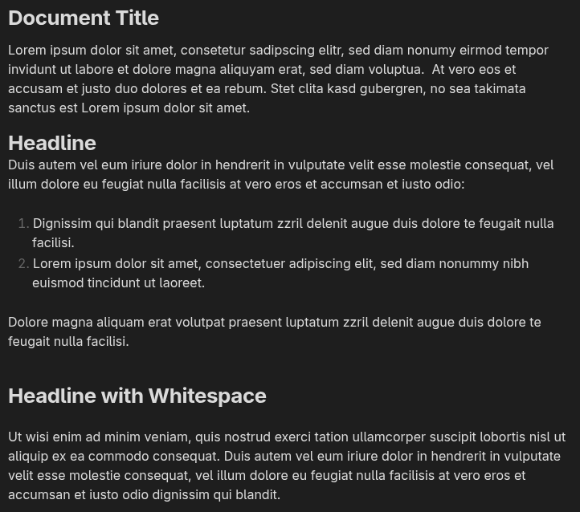

*Obsidian-Typo* is a collection of CSS snippets for *Obsidian*, refining
the typography of the rendered markdown texts.  It focuses mainly on the
way how whitespace is displayed by *Obsidian*, without affecting the
markdown code of the documents.  It is predictable, free of heuristics, and
reversible by deactivation of the snippets.

An example rendering using *Obsidian-Typo* is:

This rendering can be compared to the display obtained *without*
*Obsidian-Typo*:

The Markdown code to be rendered is in both cases the same:

.. code:: markdown

    Lorem ipsum dolor sit amet, consetetur sadipscing elitr, sed diam
    nonumy eirmod tempor invidunt ut labore et dolore magna aliquyam erat,
    sed diam voluptua.  At vero eos et accusam et justo duo dolores et ea
    rebum. Stet clita kasd gubergren, no sea takimata sanctus est Lorem
    ipsum dolor sit amet.
    # Headline
    Duis autem vel eum iriure dolor in hendrerit in vulputate velit esse
    molestie consequat, vel illum dolore eu feugiat nulla facilisis at vero
    eros et accumsan et iusto odio:

    1. Dignissim qui blandit praesent luptatum zzril delenit augue duis
       dolore te feugait nulla facilisi.
    2. Lorem ipsum dolor sit amet, consectetuer adipiscing elit, sed diam
       nonummy nibh euismod tincidunt ut laoreet.

    Dolore magna aliquam erat volutpat praesent luptatum zzril delenit
    augue duis dolore te feugait nulla facilisi.

    # Headline with Whitespace

    Ut wisi enim ad minim veniam, quis nostrud exerci tation ullamcorper
    suscipit lobortis nisl ut aliquip ex ea commodo consequat.

    Duis autem vel eum iriure dolor in hendrerit in vulputate velit esse
    molestie consequat, vel illum dolore eu feugiat nulla facilisis at vero
    eros et accumsan et iusto odio dignissim qui blandit.

To prevent horizontal overflow of the Markdown document shown above,
additional linebreaks have been added.  These breaks *only* limit the line
length.  In the document used for the rendering examples, these linebreaks
are not present, and the paragraphs are provided as one-liners.

There are two headlines presented here:  The first one (*"Headline"*) is
written directly adjacent to the continuous text around it, while the
second one (*"Headline with Whitespace"*) is padded by one single blank
line above and below.

The renderings demonstrates a couple of features implemented by
*Obsidian-Typo*:

*   The styles introduced by *Obsidian-Typo* result in unified whitespace
    around the two headlines, independent on whether they are surrounded in
    the Markdown text by blank lines (heading *Headline with Whitespace*)
    or not (as with the *Headline*).  Here, the blank lines surrounding the
    *Headline with Whitespace* are of no effect to the typeset result,
    while they remain unaltered in the Markdown sources.

*   The styles install an appropriate separation around the enumeration (in
    the section below the *Headline*), and lead to an adequate spacing
    between the two paragraphs in the second section (below *Headline with
    Whitespace*).  The resulting vertical separation is a fraction of a
    full line height.

These features are implemented in editing mode as well as in reading mode.

Most Obsidian Markdown documents will benefit from *Obsidian-Typo* right
from the beginning, without the need of manual intervention in the Markdown
source texts.

Detailed Project Description
============================

*Obsidian* is a Markdown (``.md`` files) editor.  It uses an HTML-based
interface employing *Electron*.  Due to the nature of an HTML-based GUI,
*all* interface components of *Obsidian* can be styled by CSS (*Cascading
Style Sheets*).  Style sheets can be given either as *themes* or as *CSS
snippets*.  While writing texts with Obsidian, I found the rendering of
*whitespace* often inadequate, especially whitespace around headlines, but
also in places like in the surroundings of enumerations and itemisations.
*Obsidian-Typo*, as it is presented here, is a set of CSS snippets
implementing primarily typographic rules related to whitespace, but also
addressing a few topics more.  *Obsidian* distinguishes between *reading
mode* and *editing mode*.  *Obsidian-Typo* brings these two very close to
each other, implementing all major achievements already in editing mode.
*Obsidian-Typo* is *not* a theme.  It is of no influence whatsoever on the
general UI appearance, and addresses *only* the typography in *reading
mode* and in *editing mode*.  *Obsidian-Typo* is designed in such a way,
that the application of its CSS codes to a given *Obsidian Vault* does not
require adaption of the markdown sources for the vault's documents.  It
further compensates many adjustments made before using additional blank
lines *from the beginning* wherever possible and appropriate.  Because with
*Obsidian-Typo* the typography is optimised already in editing mode, the
usage of *Obsidian* benefits from *Obsidian-Typo* early on, improving user
experience with Obsidian from the beginning of drafting Obsidian documents.

Installation
============

*Obsidian-Typo* is provided as a set of CSS snippets which can be installed
to a given Obsidian Vault.  These CSS snippets are located in the ``CSS``
folder, which is located directly besides of this README in the root
directory of the *Obsidian-Typo* repository.  The installation of
*Obsidian-Typo* consists in the following procedure:

1.  Each Obsidian vault carries a dot-directory ``.obsidian`` in its root
    directory.  CSS snippets like those provided by *Obsidian-Typo* are
    made available by copying them to a subfolder ``snippets`` of the
    ``.obsidian`` folder.  They are always installed *per vault*.  When the
    vault in question exists in ``/path/to/vault/``, the corresponding
    directory is ``/path/to/vault/.obsidian/snippets/``.  The ``snippets``
    folder does not exist in newly created Obsidian vaults in the
    beginning, it needs to be created once.

2.  After having installed the CSS snippets, they need to be *enabled* in
    the *Appearance* pane of the vault's settings in Obsidian.  The
    switches used for this purpose are located in the bottom end of the
    *Appearance* pane.

Nothing beyond these two steps is required to install *Obsidian-Typo*.  To
revert back to the state without *Obsidian-Typo*, the snippets can be
either *deactivated* in the *Appearance* pane, or they can be just
*removed* from the ``snippets`` folder.

Further hints on the installation process are provided in the documentation
referred to below at the end of this README.

Further Documentation
=====================

The complete documentation is provided in the form of an Obsidian vault.
It is distributed via a ZIP file (``Typo-Doc.zip``) located in the root
folder of this repsoitory.

The contents of the documentation archive are licensed independently from
the MIT-licensed CSS code.
